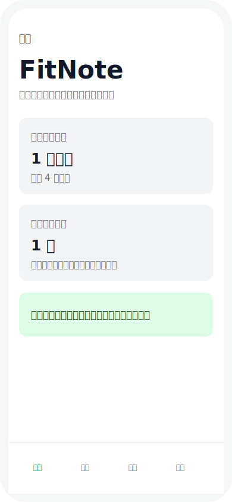
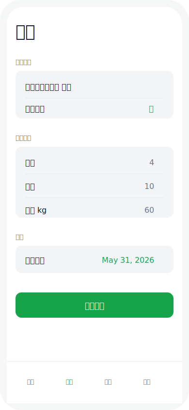
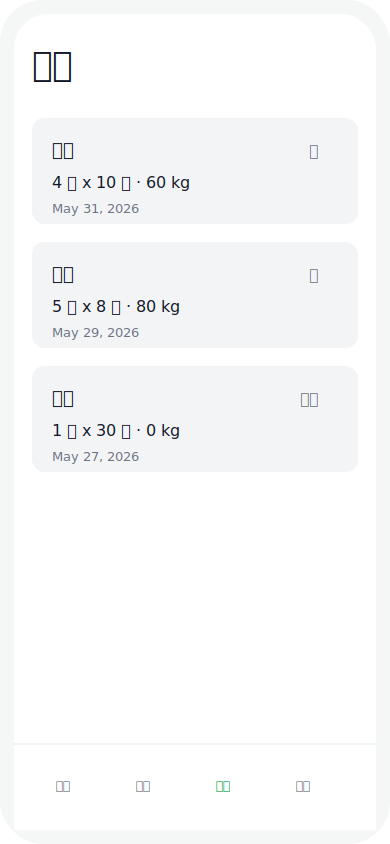
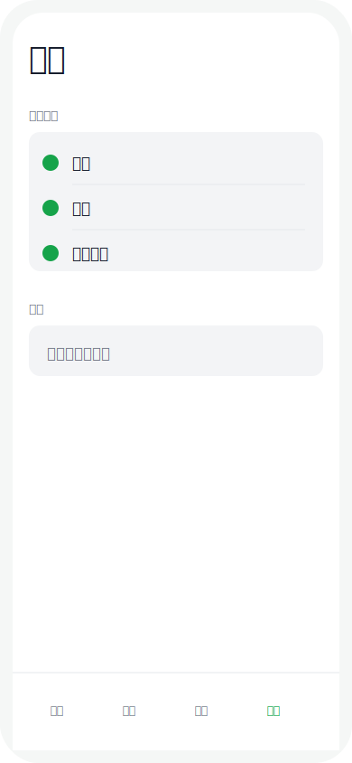

# FitNote

FitNote is my first vibe coding project: a minimal iOS fitness tracking MVP built with SwiftUI and SwiftData.

The app focuses on one simple workflow: record a workout locally, review the history, and keep a quick view of today's progress.

## Screenshots

| Home | Add Workout |
| --- | --- |
|  |  |

| History | Profile |
| --- | --- |
|  |  |

## Features

- Four-tab SwiftUI interface: Home, Add Workout, History, and Profile.
- Local workout storage with SwiftData.
- Add workout records with exercise name, body part, sets, reps, weight, and date.
- View workout history sorted by date.
- Delete workout records from history.
- Simple home dashboard with today's summary and weekly workout count.
- Static profile goals: muscle gain, fat loss, and conditioning.

## Tech Stack

- Swift
- SwiftUI
- SwiftData
- Xcode
- iOS Simulator

## Project Structure

```text
FitNote/
├── FitNoteApp.swift
├── ContentView.swift
├── Models/
│   └── WorkoutRecord.swift
└── Views/
    ├── HomeView.swift
    ├── AddWorkoutView.swift
    ├── HistoryView.swift
    └── ProfileView.swift
```

## MVP Scope

FitNote is intentionally small and beginner-friendly. This version does not include login, cloud sync, networking, third-party libraries, or HealthKit integration.

## What I Learned

- Building a basic iOS app with SwiftUI.
- Organizing an app with multiple views and a `TabView`.
- Creating a SwiftData model.
- Inserting, querying, sorting, and deleting local data.
- Keeping an MVP simple enough to understand and improve.

## Run Locally

Open `FitNote.xcodeproj` in Xcode, choose an iOS Simulator, and run the `FitNote` scheme.
